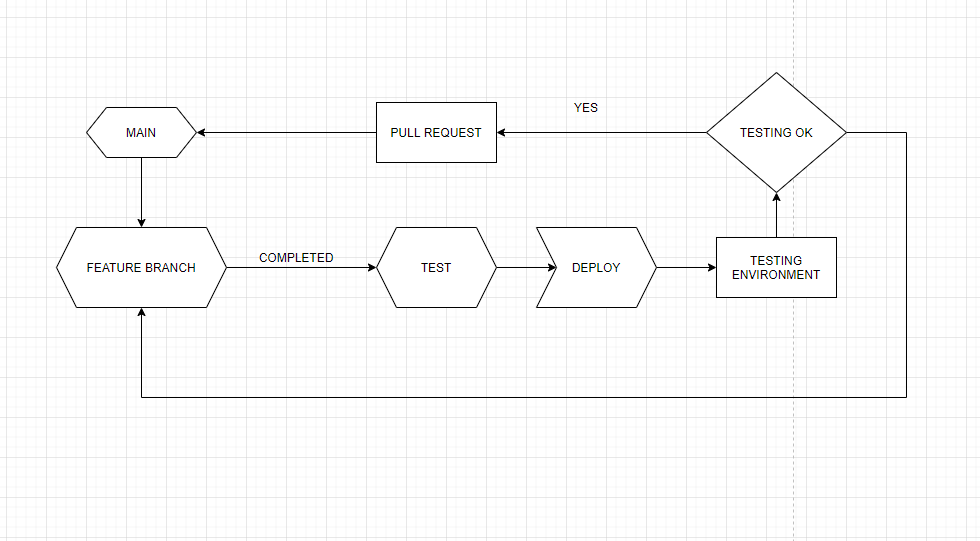

## Dokumentation
Nästan all dokumentation för Grupp 4 projekt finns på Confluence. Dokumentationen är väldigt övergripande och innehåller många olika dokument, däribland: 

* BDD - Features
* SRS
* Projektkontrakt
* Testplan (STP)
* Testmiljöer
* API calls

Det verkar som att man valt att ha all sin dokumentation på Confluence. 

## Starta upp projektet lokalt
Det saknades instruktioner för att starta upp projektet lokalt. I lokal miljö är klienten riktad mot live servern, och man fick kringgå Azure Key Vault.

Det finns API dokumentation i form av ett dokument på Confluence som hjälp till att börja använda projektet.

## Infrastruktur
- Vilka miljöer är där?

Grupp 4 använder sig utav Blazor till sin frontend och Restful API som är byggt efter MVC modellen. För deras enhetstester använder de sig utav Xunit.

Deras databas körs på en Database Server, frontend och backend körs på vardera WebApp eller ACI i Azure.

Dom använder sig utav två stycken Azure Container Registries, en för testmiljö och en för produktionsmiljö. Där båda registries har två separerade repositories, en för backend och en för frontend.

- Hur kommer man åt dom?

  Koden för frontend, backend och enhetstesterna finns i samma solution, denna solution kommer man åt via ett GitHub repository.

  

  Vi misstänker att alla Azure resurser ligger under samma Resource Group uppe i Azure.

  

- När deployas dom?

Det först deploy steget börjar när en feature är klar och har mergats in i Test branchen, då aktiveras pipelinen för testmiljön och deployas till en testmiljö. Och som vi förstår så uppdateras WebAppen/ACI för testmiljön på den senaste image, för respektive backend och frontend.

Själva produktionsmiljön deployas efter att test/utvecklings branchen har mergats in och körs i en separat pipeline så att produktionsmiljön uppdateras till det senaste.

## Branching och merging strategi

I main branchen ska endast finnas färdig och testad kod. 

Alla nya branches ska göras utifrån main branchen och när en feature / issue är färdig ska den först mergas in till "Test" branchen och därefter ska en pull request som pekar på main skapas. 

Test-branchen deployas till en testmiljö där testarna kontrollerar att featuren håller måttet, om testarna godkänner featuren så kommer det skapas en pullrequest till main på denna issue som måste godkännas av utvecklarna, om den inte skulle godkännas går den tillbaka till utvecklarna. Därefter fortsätter utvecklarna på branchen och åtgärdar det som behövs för att sedan skicka tillbaka till testarna. Detta upprepas tills att testarna och utvecklarna anser att featuren är buggfri och fungerande.

## C4

 
